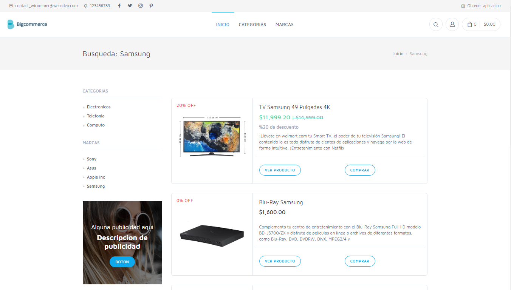
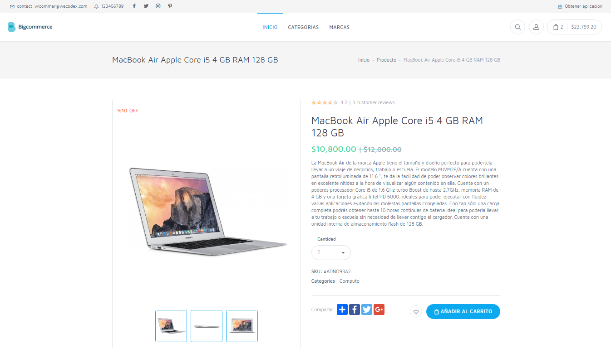
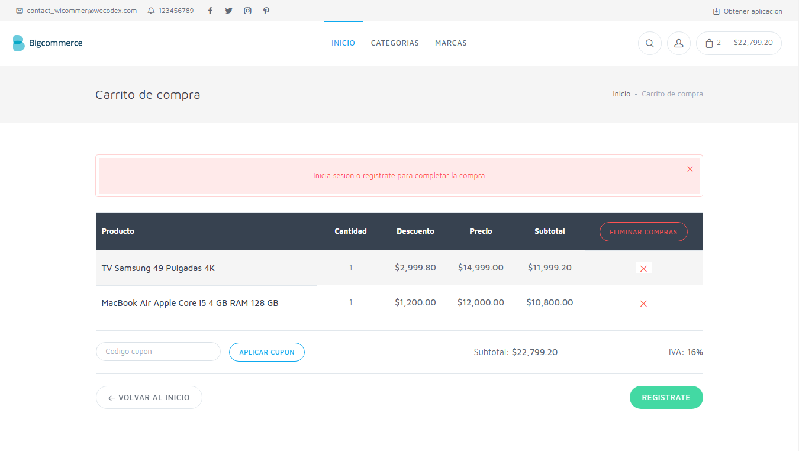
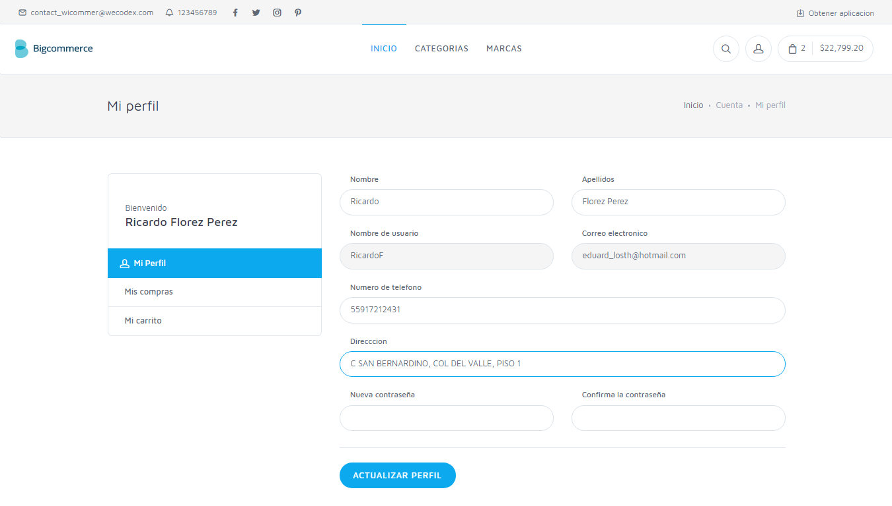
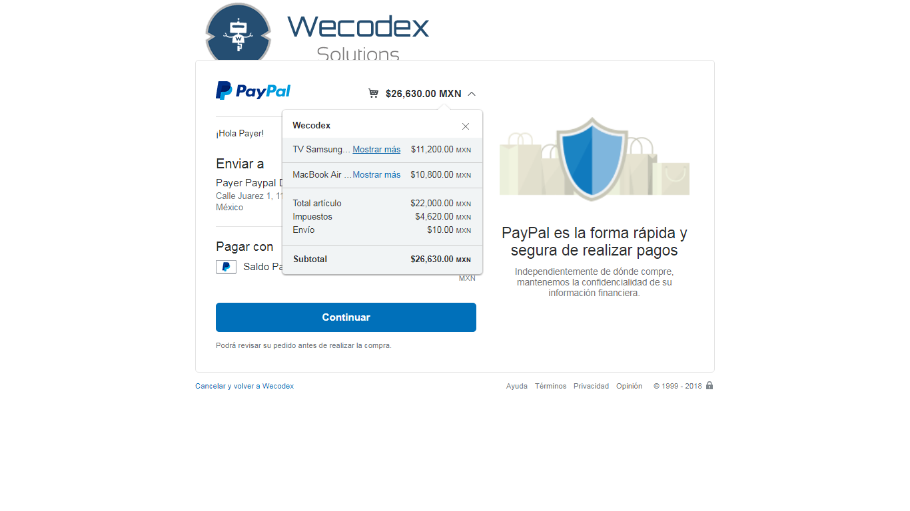
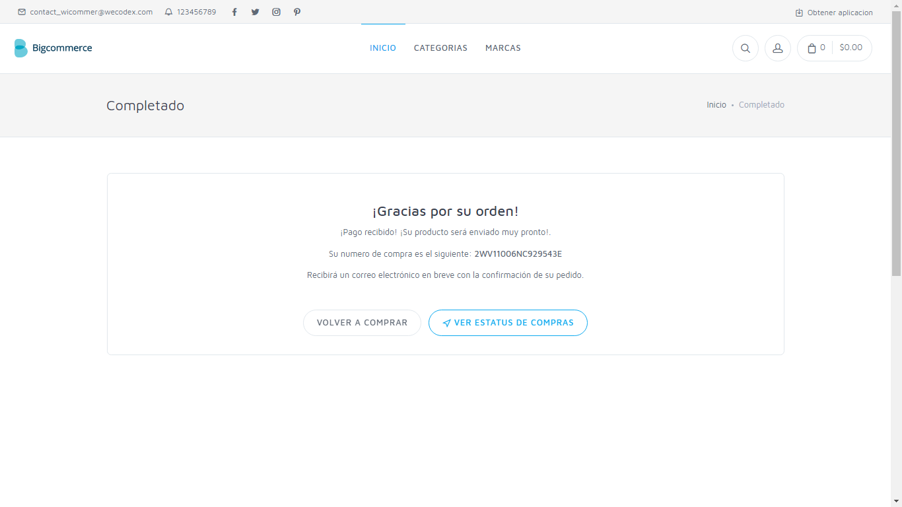
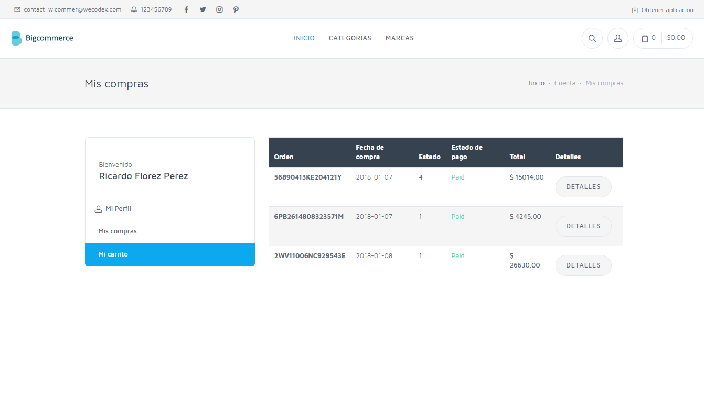

# Sistema de Tienda Online con Pasarela de Pagos PayPal

Este sistema de tienda en línea con integración de PayPal te permite crear un carrito de compras y procesar pagos automáticos mediante la pasarela de PayPal.

## Módulos

### Frontend
- Carrito de compras
- Top productos
- Detalles de producto
- Registro de clientes

### Backend
- Gestión de productos
- Gestión de pagos
- Gestión de clientes
- Gestión de diapositivas
- Gestión de categorías
- Gestión de marcas

## Capturas de Pantalla

## Demostración
Usuario: admin  
Contraseña: password

## Importante
Para realizar una compra es necesario contar con algún usuario SandBox de PayPal.
Si no cuentas con ninguno, por favor ponte en contacto con nosotros vía Facebook.
Nosotros te proporcionaremos un usuario.

## Especificaciones Técnicas
- Desarrollado en PHP 7.4 (legacy)
- Proyecto open source con fines educativos